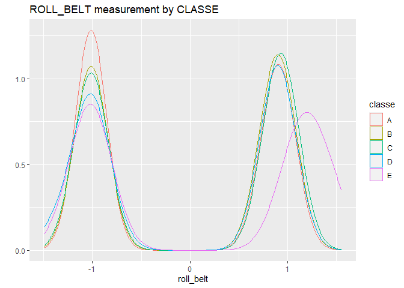

# Synopsis

In the analysis below, I fit a model to predict the type of activity being done, using numerous metrics recorded from a fitness band.  The dataset is filled with records of an individual performing an activity in one of 5 ways as defined in the variable CLASSE:

  1. according to specs
  2. throwing elbows forward
  3. lifting dumbbell halfway
  4. lowering dumbbell halfway
  5. throwing hips forward

 

To predict the activity type, I followed the following steps in the model building process:

**Steps of the Model Build**

  1. Data Import and Cleaning
  2. Pre-processing and Standardization
  3. Exploratory Data Analysis
  4. Model Fitting with Cross Validation
  5. Model Validation and OOS estimation
  6. Prediction on Holdout dataset

## Setup

Start by setting (echo = TRUE) and declaring libraries to be used


```r
knitr::opts_chunk$set(echo = TRUE, warning = FALSE)  #"always use echo = TRUE" for this assignment, per notes

library(dplyr)
library(caret)
library(ggplot2)
```
## Data Import and Cleaning

In the data processing step, I import the data, remove columns that are nearly all NA, and remove columns that are near zero variance.  There's a segment unused in the final model fit that downsamples the data since the data size resulted in slower exploratory run times.


```r
  training <- read.csv("pml-training.csv")
  testing <- read.csv("pml-testing.csv")
  training <- training[,-(1:7)]  #remove columns that aren't independent predictor variables
  training <- training %>%       #reorder to move classe to front of data frame
    select(classe, everything())
  training$classe <- factor(training$classe)
  training <- training[,colMeans(is.na(training))<0.97] #select those that aren't all na's
  near_zero_variance_chars_to_drop <- nearZeroVar(training)
  training_trimmed <- training[,-near_zero_variance_chars_to_drop]
  
  ## this step was not used in the final fit, but helped make the process faster
  ## a downsampled dataset can be used to perform exploratory model fits
  downSampleIndicator <- createDataPartition(y=training_trimmed$classe, p=1.0, list=FALSE)
  downSampledData <- training_trimmed[downSampleIndicator,]
```
## Pre-processing and standardizing

Here, I separate the training data into training and validation sets, using a 80/20 split.  I standardize the independent variables the model uses to the same scale and centering. 


```r
###SET SEED###
set.seed(16)
###Training/Validation###
inTrain <- createDataPartition(y=downSampledData$classe, p=0.80, list=FALSE)
training <- downSampledData[inTrain,]
validation <- downSampledData[-inTrain,]
###Preprocessing to center and scale###

training_copy <- training[,-1]
validation_copy <- validation[,-1]
preObj <- preProcess(training_copy, method=c("center", "scale"))
training_standardized <- predict(preObj, training_copy)
round(sapply(training_standardized[,1:10], mean),1)
```

```
##        roll_belt       pitch_belt         yaw_belt total_accel_belt 
##                0                0                0                0 
##     gyros_belt_x     gyros_belt_y     gyros_belt_z     accel_belt_x 
##                0                0                0                0 
##     accel_belt_y     accel_belt_z 
##                0                0
```

```r
validation_standardized <- predict(preObj, validation_copy)
training_standardized <- cbind(training$classe,training_standardized)
validation_standardized <- cbind(validation$classe,validation_standardized)
training_standardized <- training_standardized %>%
  rename(classe = `training$classe`)
validation_standardized <- validation_standardized %>%
  rename(classe = `validation$classe`)
```

## Exploratory data analysis

Here are a few charts showing how measurements vary by the "CLASSE" variable.  It is notable how some "CLASSE" patterns are different in the resulting measurements.  For example, we can note that the forearm pitch is different in CLASSE C.


```r
ggplot(data=training_standardized, aes(x=pitch_forearm, group=classe, fill=classe)) +
  geom_density()+
  facet_wrap(~classe)+
  ggtitle("PITCH_FOREARM measurement by CLASSE")
```

<!-- -->

```r
qplot(roll_belt, color=classe, data=training_standardized, geom="density", main="ROLL_BELT measurement by CLASSE")
```

<!-- -->

```r
qplot(yaw_belt, color=classe, data=training_standardized, geom="density", main="YAW BELT measurement by CLASSE")
```

<!-- -->
## Model Fitting with Cross Validation

In this segment, I use 10 fold cross validation to fit a GBM model and then plot important variables and performance measures.  The accuracy on cross validation with a depth of 3 trees is 95% + .


```r
#method: The resampling method: "boot", "boot632", "optimism_boot", "boot_all", "cv", "repeatedcv",
#number: Either the number of folds or number of resampling iterations
model_control <- trainControl(method="cv", number=10)
#GBM#
modFit_gbm <- train(classe ~ ., method="gbm", data=training_standardized, trControl = model_control, verbose=FALSE)
#Variable Importance chart#
summary(modFit_gbm)
```

<!-- -->

```
##                                       var     rel.inf
## roll_belt                       roll_belt 17.27204561
## pitch_forearm               pitch_forearm  9.38166214
## yaw_belt                         yaw_belt  9.11841750
## magnet_dumbbell_z       magnet_dumbbell_z  6.74604366
## roll_forearm                 roll_forearm  5.38054941
## magnet_dumbbell_y       magnet_dumbbell_y  5.36870953
## pitch_belt                     pitch_belt  4.69743566
## magnet_belt_z               magnet_belt_z  3.58500884
## gyros_belt_z                 gyros_belt_z  2.92452767
## roll_dumbbell               roll_dumbbell  2.52903374
## accel_forearm_z           accel_forearm_z  2.20209369
## accel_dumbbell_z         accel_dumbbell_z  2.15354682
## accel_dumbbell_y         accel_dumbbell_y  2.09003173
## accel_forearm_x           accel_forearm_x  2.04803124
## magnet_forearm_z         magnet_forearm_z  1.91058784
## yaw_arm                           yaw_arm  1.77194581
## gyros_dumbbell_y         gyros_dumbbell_y  1.52878743
## accel_dumbbell_x         accel_dumbbell_x  1.44530440
## magnet_belt_x               magnet_belt_x  1.43288988
## magnet_belt_y               magnet_belt_y  1.39013086
## magnet_dumbbell_x       magnet_dumbbell_x  1.29698535
## magnet_arm_z                 magnet_arm_z  1.19671122
## accel_belt_z                 accel_belt_z  1.10625774
## magnet_forearm_x         magnet_forearm_x  1.03170984
## gyros_arm_y                   gyros_arm_y  0.94556882
## magnet_arm_y                 magnet_arm_y  0.87224124
## roll_arm                         roll_arm  0.78629323
## gyros_belt_y                 gyros_belt_y  0.78101678
## total_accel_dumbbell total_accel_dumbbell  0.71508899
## magnet_forearm_y         magnet_forearm_y  0.60067909
## accel_arm_x                   accel_arm_x  0.56371767
## magnet_arm_x                 magnet_arm_x  0.54649084
## gyros_dumbbell_x         gyros_dumbbell_x  0.48560921
## accel_arm_y                   accel_arm_y  0.39006506
## accel_forearm_y           accel_forearm_y  0.38174272
## accel_arm_z                   accel_arm_z  0.30343718
## total_accel_forearm   total_accel_forearm  0.29062326
## yaw_dumbbell                 yaw_dumbbell  0.28895088
## gyros_arm_x                   gyros_arm_x  0.27534405
## gyros_dumbbell_z         gyros_dumbbell_z  0.27297982
## gyros_forearm_z           gyros_forearm_z  0.26396769
## pitch_dumbbell             pitch_dumbbell  0.26186492
## total_accel_arm           total_accel_arm  0.25408935
## gyros_forearm_y           gyros_forearm_y  0.22178823
## yaw_forearm                   yaw_forearm  0.17700220
## total_accel_belt         total_accel_belt  0.16925331
## pitch_arm                       pitch_arm  0.16568635
## gyros_forearm_x           gyros_forearm_x  0.12397148
## gyros_belt_x                 gyros_belt_x  0.12394358
## accel_belt_x                 accel_belt_x  0.06629440
## gyros_arm_z                   gyros_arm_z  0.06384204
## accel_belt_y                 accel_belt_y  0.00000000
```

```r
#Cross validation accuracy by # of Boosting Iterations
plot(modFit_gbm)
```

<!-- -->

## OOS Estimation

Here I predict the model accuracy on the validation dataset, which represents out of sample error.  The OOS accuracy is 96%.


```r
model_CFM <- confusionMatrix(predict(modFit_gbm, validation_standardized), factor(validation_standardized$classe))
model_CFM
```

```
## Confusion Matrix and Statistics
## 
##           Reference
## Prediction    A    B    C    D    E
##          A 1094   23    0    0    2
##          B   12  710   23    5    5
##          C    6   25  655   15    6
##          D    3    0    5  617   11
##          E    1    1    1    6  697
## 
## Overall Statistics
##                                           
##                Accuracy : 0.9618          
##                  95% CI : (0.9553, 0.9675)
##     No Information Rate : 0.2845          
##     P-Value [Acc > NIR] : < 2.2e-16       
##                                           
##                   Kappa : 0.9516          
##                                           
##  Mcnemar's Test P-Value : 0.0006875       
## 
## Statistics by Class:
## 
##                      Class: A Class: B Class: C Class: D Class: E
## Sensitivity            0.9803   0.9354   0.9576   0.9596   0.9667
## Specificity            0.9911   0.9858   0.9839   0.9942   0.9972
## Pos Pred Value         0.9777   0.9404   0.9264   0.9701   0.9873
## Neg Pred Value         0.9922   0.9845   0.9910   0.9921   0.9925
## Prevalence             0.2845   0.1935   0.1744   0.1639   0.1838
## Detection Rate         0.2789   0.1810   0.1670   0.1573   0.1777
## Detection Prevalence   0.2852   0.1925   0.1802   0.1621   0.1800
## Balanced Accuracy      0.9857   0.9606   0.9708   0.9769   0.9820
```
## Testing Dataset Prediction

Finally, I predict the results on the given TESTING dataset.


```r
## Predict on the testing dataset ##
testing_copy <- testing
testing_standardized <- predict(preObj, testing_copy)
predict(modFit_gbm, testing_standardized)
```

```
##  [1] B A B A A E D B A A B C B A E E A B B B
## Levels: A B C D E
```
